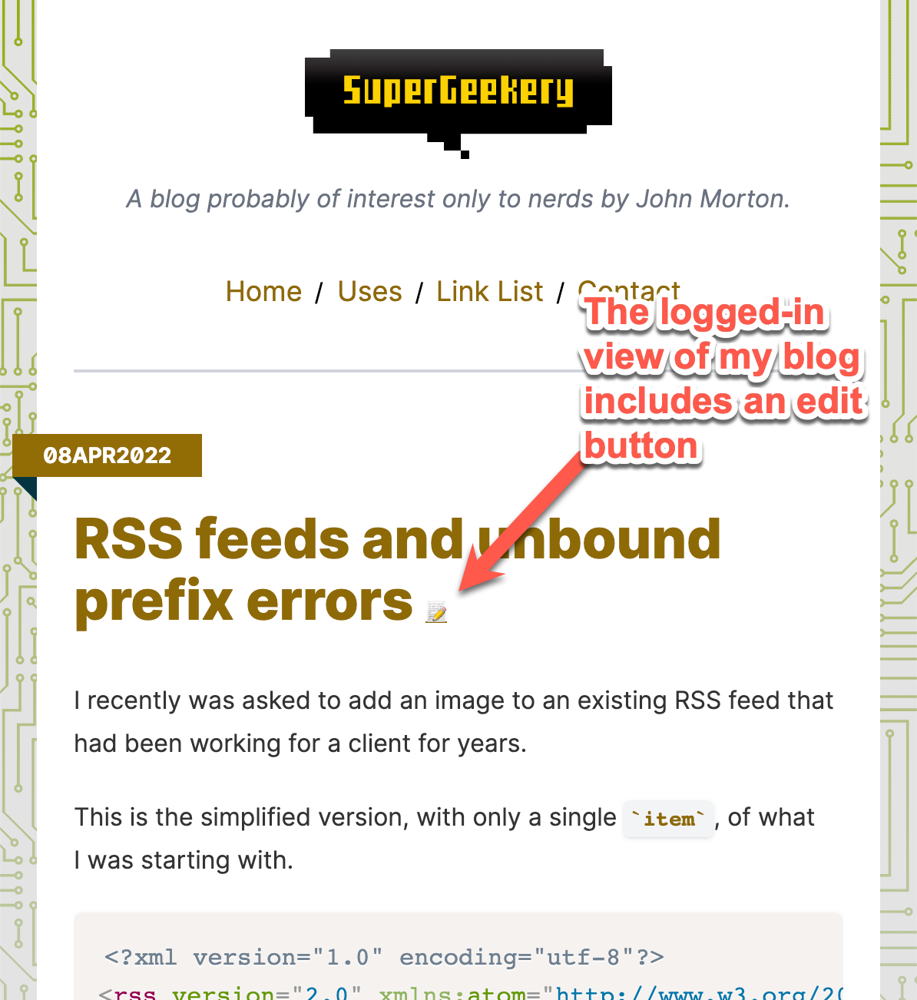

# Entry Editor Link Plugin

This is a plugin for Craft CMS, version 4 or version 5. It helps make front-end entry edit links for your entry authors. It's design to work well with statically cached sites, like those using FastCGI Cache. See the [Overview](#overview) section below for more information.

Here's an example of how my blog looks to me when I'm logged into the site. I can click the pencil icon to edit the entry in the control panel.



## Requirements

This plugin requires Craft CMS 4.4.7.1 or later, and PHP 8.0.2 or later. It is also compatible with Craft CMS 5.x.

## Installation

You can install this plugin from the Plugin Store or with Composer.

#### From the Plugin Store

Go to the Plugin Store in your project’s Control Panel and search for “entry-editor-links”. Then press “Install”.

#### With Composer

Open your terminal and run the following commands:

```bash
# go to the project directory
cd /path/to/my-project.test

# tell Composer to load the plugin
composer require johnfmorton/craft-entry-editor-links

# tell Craft to install the plugin
./craft plugin/install entry-editor-links
```

### Overview

This plugin helps generate links to the Craft CMS entry editor for a given entry. This functionality is easy to create in Twig templates, but if you have a page statically cached, like with FastCGI Cache, you could run into instances where the edit entry link is shown to a user who doesn't have permission to edit the entry.

This plugin solves that problem by providing a Twig function that can be used to determine if a page is being rendered on the front end of the site. If it is, you can render a `data-edit-link` attribute on the element in your template displaying the entry ID. Then, using JavaScript, you can query the plugin's API endpoint which will return the control panel edit URL if the user is logged in and has permission to edit the entry. Then you can add a link to the edit page in the DOM for the entry.

Exposing only an entry ID helps prevent leaking information about your site's structure to users who don't have permission to edit entries.

### Plugin functionality

The plugin does two things:

1. It provides an endpoint that expects an entry ID and returns a JSON object with the entry's edit URL.
2. It also provides a Twig function, `isFrontEndPageView()` to determine if a page is being rendered on the front end of the site. This is to prevent the edit links from being displayed when a user has the preview pane open while editing an entry in the control panel or if the entry is being rendered on the front end of the site using a preview token.

### Using the plugin

The first step is to render the `data-edit-link` attribute on the element in your template to display the entry ID for the entry you wish to be able to edit. 

Do this by wrapping the attribute in a conditional that checks if the page is being rendered on the front end of the site. 

```
data-edit-link="{{ entry.id }}"
```

If you have a list of entries, you can add the `data-edit-link` attribute to the element that wraps each entry. For example, you can put this data attribute on the `article` element that wraps each entry.

```
<article  data-edit-link="{{ entry.id }}">
    <h2>{{ entry.title }}</h2>
    <p>{{ entry.body }}</p>
</article>
```

Then, after a page loads, look for any instance of the `data-edit-link` attribute and query the plugin's API endpoint to get the entry's edit URL. If the user is logged in and has permission to edit the entry, the plugin will return the entry's edit URL. Then you can add a link to the edit page in the DOM for the entry.

Here's a basic example of how you can do this using JavaScript. You can add this to a JavaScript file that is loaded on the front end of your site.

```
window.addEventListener('load', () => {
    // get all the elements with a data-attribute of 'edit-link'
    const editLinks = document.querySelectorAll('[data-edit-link]');
    // loop through the divs
    editLinks.forEach((editLink) => {
        // get the id from the data attribute
        const id = editLink.getAttribute('data-edit-link');
        // confirm the id is a number
        if (id && parseInt(id)) {
            // make a request to the plugin's API endpoint
            fetch('/actions/entry-editor-links/entry-processor/cp-link?id=' + id)
                .then((response) => {
                    // if the response is ok, return the json
                    if (response.ok) {
                        return response.json();
                    }
                    // otherwise, return an empty object
                    return null;
                })
                .then((data) => {
                    // data object will look like this: : { success: true, message: URL } or : { success: false, message: error message }
                    // if the data has success==true and a message, add a link to the edit page
                    if (data.success && data.message) {
                        // create an anchor element
                        const link = document.createElement('a');
                        // set the href attribute
                        link.setAttribute('href', data.message);
                        // set the text
                        link.innerText = 'Edit 📝';
                        // add some styles to the edit button
                        link.style.backgroundColor = '#f1f1f1';
                        link.style.color = '#333';
                        link.style.borderRadius = '5px';
                        link.style.border = '1px solid #ccc';
                        link.style.textDecoration = 'none';
                        link.style.boxShadow = '0 0 10px rgba(0,0,0,0.1)';
                        link.style.zIndex = '9999';
                        link.style.fontFamily = 'Arial, sans-serif';
                        link.style.fontSize = '14px';
                        // open the link in a new tab
                        link.setAttribute('target', '_blank');
                        // append the link to the div
                        editLink.appendChild(link);
                    }
                })
                .catch((error) => {
                    // log any errors
                    console.error(error);
                }
            );
        }
    })
});
```

### Using the plugin with FastCGI Cache

If you're using FastCGI Cache, you'll need to add a rule to prevent the plugin's API endpoint from being cached. This is because the plugin's API endpoint returns different data depending on whether the user is logged in and has permission to edit the entry. If the endpoint is cached, the edit link will be shown to users who don't have permission to edit the entry.

Here are examples of what that rule might look like for Apache and Nginx servers. Your server may require a different rules, but this should give you an idea of what you need to do.

#### Using a `.htaccess` file with an Apache server


```
# Don't cache the Entry Editor Links API endpoint
# Uses the mod_headers Apache module
<IfModule mod_headers.c>
    <LocationMatch "^/actions/entry-editor-links">
        Header set Cache-Control "no-store, no-cache, must-revalidate, max-age=0"
    </LocationMatch>
</IfModule>
```

#### Using a `nginx.conf` file with an Nginx server

```
# Don't cache the Entry Editor Links API endpoint
location ~ ^/actions/entry-editor-links {
    set $nocache 1;
}
```
